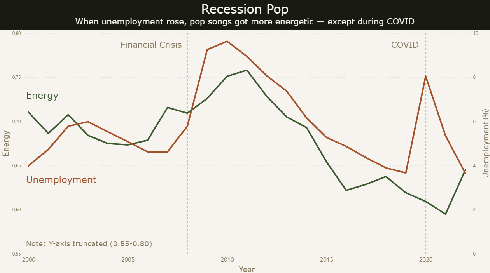
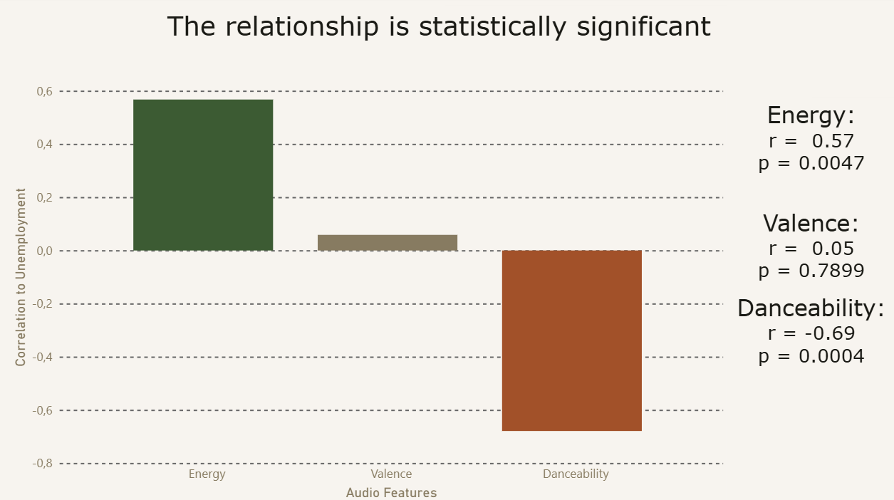
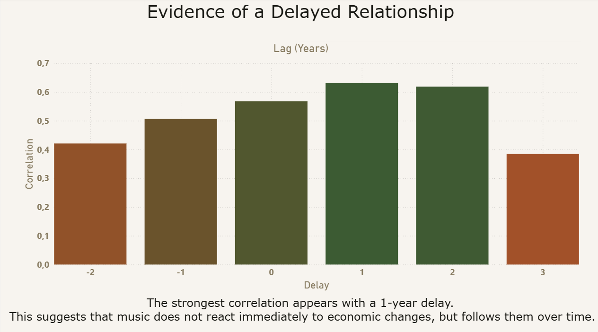
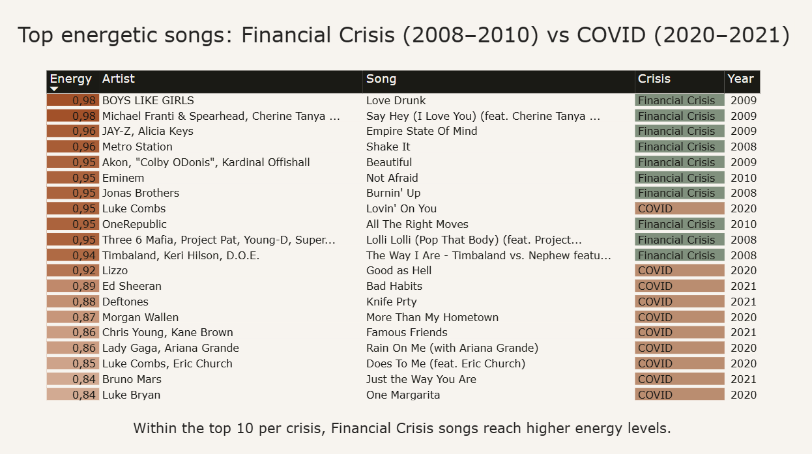
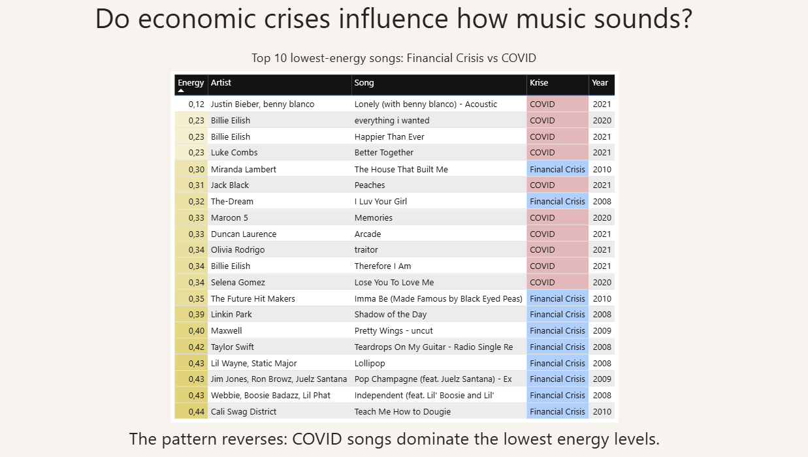

# Recession Pop

## Project Snapshot

- **Type:** exploratory data analysis  
- **Tools:** Python · pandas · SciPy · Power BI  
- **Data:** Billboard Hot 100 · Spotify audio features · World Bank macro indicators  
- **Focus:** music audio features · unemployment · economic crises  
- **Output:** correlation analysis, lag analysis, interactive Power BI dashboard

## 🔑 Key Takeaway

The data supports part of the “Recession Pop” idea.

From 2000 to 2022, higher US unemployment was associated with higher song energy and lower danceability in Billboard Hot 100 songs. The strongest energy relationship appears with a one-year delay.

COVID-19 breaks the pattern, suggesting that pandemic-era music consumption may have worked differently from earlier economic crises.

## 🧭 Overview

“Recession Pop” describes the idea that popular music becomes more energetic during economic downturns.

This project tests that claim using Billboard Hot 100 data, Spotify audio features, and US macroeconomic indicators.

The analysis focuses on whether unemployment is linked to changes in energy, danceability, and valence, and whether the relationship appears immediately or with a delay.

## 📸 Dashboard Preview

## 🎯 Research Question

Do economic conditions in the United States influence musical characteristics, and if so, how?

## 🧠 Analytical Framing

The project does not assume that economic crises directly cause musical change.

Instead, it tests whether macroeconomic pressure and popular music features move together over time.

The analysis is exploratory: it looks for measurable patterns, delayed relationships, and exceptions such as COVID-19.

## 📊 Data Sources

Detailed source documentation is available in:

`DATA_SOURCES.md`

Main datasets:

- Billboard Hot 100 + Spotify audio features
- World Bank macroeconomic indicators

### Audio Features

- **Valence** – how positive or happy a song sounds  
- **Energy** – intensity and activity level  
- **Danceability** – how suitable a song is for dancing  

> Spotify audio features are proprietary algorithmic estimates and should be interpreted cautiously.  
> A related validity reference is documented in `DATA_SOURCES.md`.

## ⚙️ Methodology

- Aggregation of Billboard data by year  
- Merging with US economic indicators  
- Pearson correlation analysis  
- Spearman correlation as a robustness check  
- Lag analysis (-2 to +3 years) to test delayed relationships  
- Statistical significance testing (p-values)  
- Data visualization using Power BI  

## 📈 Key Results

The analysis shows a clear pattern between unemployment and selected audio features.

| Feature | r | p-value | Interpretation |
|---|---:|---:|---|
| Energy | +0.57 | 0.0047 | Rises with unemployment |
| Danceability | -0.69 | 0.0004 | Falls with unemployment |
| Valence | +0.05 | 0.7899 | No meaningful relationship |

**Lag analysis**  
The strongest energy correlation appears with a one-year delay (r = 0.63), suggesting that music follows economic pressure rather than reacting immediately.

**Robustness check**  
Spearman correlation gives a similar result (ρ = 0.53), reducing the risk that the finding is driven only by outliers or strict linear assumptions.

**COVID-19 exception**  
No clear “Recession Pop” effect appears during COVID-19. This may reflect changes in listening behavior, social isolation, or a shift toward more introspective music.

## 🔬 Statistical Note

The analysis uses 23 yearly observations from 2000 to 2022, so the results should be interpreted as exploratory rather than conclusive.

Pearson correlation is used for linear association, while Spearman correlation is used as a robustness check.

The analysis was also repeated from 1991, the earliest available macroeconomic year. The overall pattern remained similar.

Spotify audio features are proprietary algorithmic estimates. Energy is interpreted with more confidence than danceability, based on the validity discussion documented in `DATA_SOURCES.md`.

## ⚠️ Limitations

- Billboard reflects chart success, not actual listening behavior
- Spotify audio features are proprietary algorithmic estimates
- Audio features for older songs may be retroactively calculated
- The sample size is limited to yearly observations
- Correlation does not imply causation 

## 🧹 Data Cleaning

- 172 karaoke entries removed due to incorrect audio features  
- Artist name formatting standardized

## 🛠️ Tools

- Python (Pandas, SciPy)  
- Power BI  

## 🤖 Use of AI (Transparency)

AI tools were used to support wording, structuring, and parts of the code.

The core analysis, interpretation, and all decisions were developed independently.